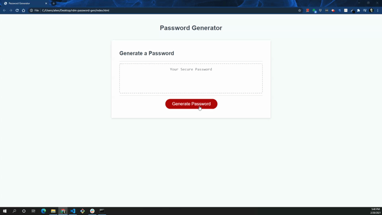

# Description - Random Password Generator

This is an application utilizing Javascript to randomly generate a password based on user selections for length and character type.  

Included in this application are:
* Utilized loops to provide needed operations within JS
    * Utilized a `while` loop to validate user input to ensure that the script function could proceed properly
    * Utilized a `for` loop to randomly assign characters to the password according to the user specified criteria

* Prompt, alert and confirm to provide a user-friendly UI/UX
    * In addition to required prompts for user-requested character types, included a `confirm` dialogue box to allow user to exit the script if they accidently entered the wrong number of characters
    * 

Challenges I encountered
* After initially struggling with the loop to validate the user input, I was able to validate the input with a single line of code, keeping the code clean and succinct 
* I also had difficulty with the method to choose password characters randomly with first returning back as undefined, then returning back with commas. I eventually determined the culprit to be missing semicolons. 
* An issue with the random selection method was found where the code was only choosing from the list of available characters up to the array index item number that correlated to the input for the password length. By changing my syntax correctly, the function now chooses from the entire array of available character types. 

## Credits
Many thanks to the below individuals who provided input, suggestions, or played a "rubber ducky" role
* Jay Yousef
* Mim Armand
* Stephen Simone
* Stacy Brown
* Samuel Roth

If any additional issues are found, or if there are any suggestions for improvement, please send an email to site developer Chris Martinez at cbmartinez42@gmail.com

---

## <ins>Installation</ins>
1.  Clone or download .zip file from Github to your local computer
2.  Open index.html via your preferred browser or code/text editor

### <ins>Cloning</ins>
1. From Github, select the "Code" button, choose either HTTPS or SSH as appropriate
2. Click the copy button  to add it to your clipboard
3. In your preferred command line (terminal, bash, etc), navigate to the folder you'd like to download the repository into
4. Type `git clone [pasted url from clipboard]` and press enter
5. Access the content with your code editor by either typing `code .` in your command line or by using your editor's `File > Open Folder` in your code editor menu. If only viewing in a browser, simply double click index.html to open in your default browser

### <ins>Zip file</ins>
1. From Github, select the "Code" button, then select "Download ZIP"
2. Choose which folder to download the repository into via the dialog box that appears
3. After downloading, open the .zip file and select "Extract All" from the top of the window that appears
4. Access the content with your code editor by selecting `File > Open Folder` in your code editor menu. If only viewing in a browser, simply double click index.html to open in your default browser

[https://cbmartinez42.github.io/rdm-password-gen/](https://cbmartinez42.github.io/rdm-password-gen/)

---

These updates are covered under [GNU General Public License v3.0](./COPYING.txt)

## Screenshot below:

